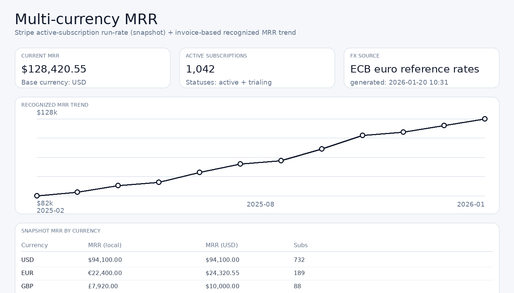

# Multi-Currency MRR Calculator

A lightweight Next.js dashboard that calculates your Monthly Recurring Revenue from Stripe, with built-in support for multiple currencies.

Built for [Laudos.AI](https://laudos.ai) and open-sourced for the community.



## What it does

- **Snapshot MRR**: Shows your current run-rate from all active + trialing Stripe subscriptions
- **Trend Chart**: Visualizes MRR over time by distributing paid invoice amounts across their service periods
- **Multi-currency**: Automatically converts all currencies to your base currency using ECB exchange rates
- **Per-currency breakdown**: See exactly how much MRR is coming from each currency

## Why we built this

If you're selling internationally, your Stripe dashboard shows revenue in multiple currencies but doesn't give you a single unified MRR number. We needed one, so we built this.

The ECB (European Central Bank) publishes daily reference rates for 30+ currencies against the Euro. This app uses those rates to convert everything into your preferred base currency (USD by default).

## Getting started

```bash
# Clone it
git clone https://github.com/Vajbratya/osincompanylaimmrcalc.git
cd osincompanylaimmrcalc

# Set up your environment
cp .env.example .env.local
# Add your Stripe secret key to .env.local

# Install & run (works with npm, yarn, pnpm, or bun)
npm install
npm run dev
```

Open http://localhost:3000 and you're good to go.

## Configuration

**Environment variables:**

| Variable | Required | Default | Description |
|----------|----------|---------|-------------|
| `STRIPE_SECRET_KEY` | Yes | - | Your Stripe secret key |
| `BASE_CURRENCY` | No | `USD` | Currency to convert everything into |
| `LOOKBACK_MONTHS` | No | `12` | How many months of history to show (max 60) |

**API query params:**

You can override settings per-request:
- `/api/mrr?base=EUR` — use EUR as base currency
- `/api/mrr?months=24` — show 24 months of history

## How it works

### Snapshot MRR

Pulls all `active` and `trialing` subscriptions from Stripe, then:
1. Gets the unit price for each subscription item
2. Normalizes everything to monthly (annual plans ÷ 12, etc.)
3. Converts to your base currency using ECB rates

### Recognized MRR (Trend)

Uses paid invoices instead of current subscriptions:
1. Fetches all paid invoices in your lookback window
2. For each invoice line item, distributes the amount across its service period
3. Sums up what "belongs" to each calendar month

This gives you a more accurate picture of revenue over time, especially if you have annual plans or mid-cycle upgrades.

### Currency conversion

Exchange rates come from the [ECB daily reference feed](https://www.ecb.europa.eu/stats/eurofxref/eurofxref-hist.xml). Rates are cached for 12 hours.

Supported currencies: EUR, USD, GBP, JPY, CHF, AUD, CAD, and [many more](https://www.ecb.europa.eu/stats/policy_and_exchange_rates/euro_reference_exchange_rates/html/index.en.html).

> **Note**: ECB rates are published for informational purposes only — they're not meant for executing transactions. For financial reporting, these are typically close enough.

## Limitations

Things this tool intentionally skips:

- **Coupons & discounts** — Snapshot MRR uses list prices
- **Prorations** — Recognized MRR excludes proration line items
- **Metered billing** — Can't predict usage-based revenue
- **Tiered pricing** — Only handles per-unit billing

If your Stripe account uses a currency not covered by ECB (pretty rare), those subscriptions will be skipped with a warning.

## Tech stack

- [Next.js 14](https://nextjs.org) (App Router)
- [Tailwind CSS 4](https://tailwindcss.com)
- [React Query](https://tanstack.com/query) for data fetching
- [big.js](https://mikemcl.github.io/big.js) for precise currency math
- [Zod](https://zod.dev) for runtime validation

## Contributing

Found a bug? Have an idea? PRs and issues are welcome.

## License

MIT — do whatever you want with it.

---

Made with care by the [Laudos.AI](https://laudos.ai) team.
